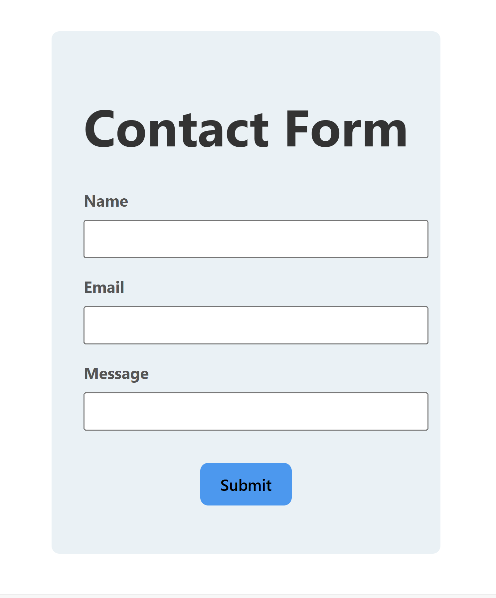
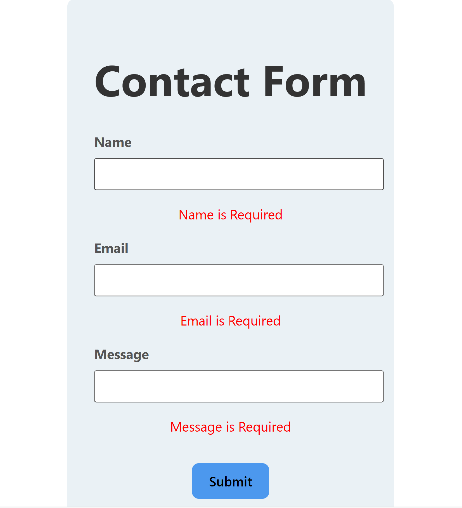
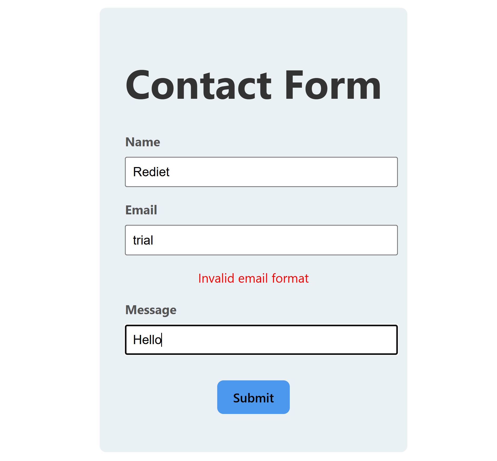
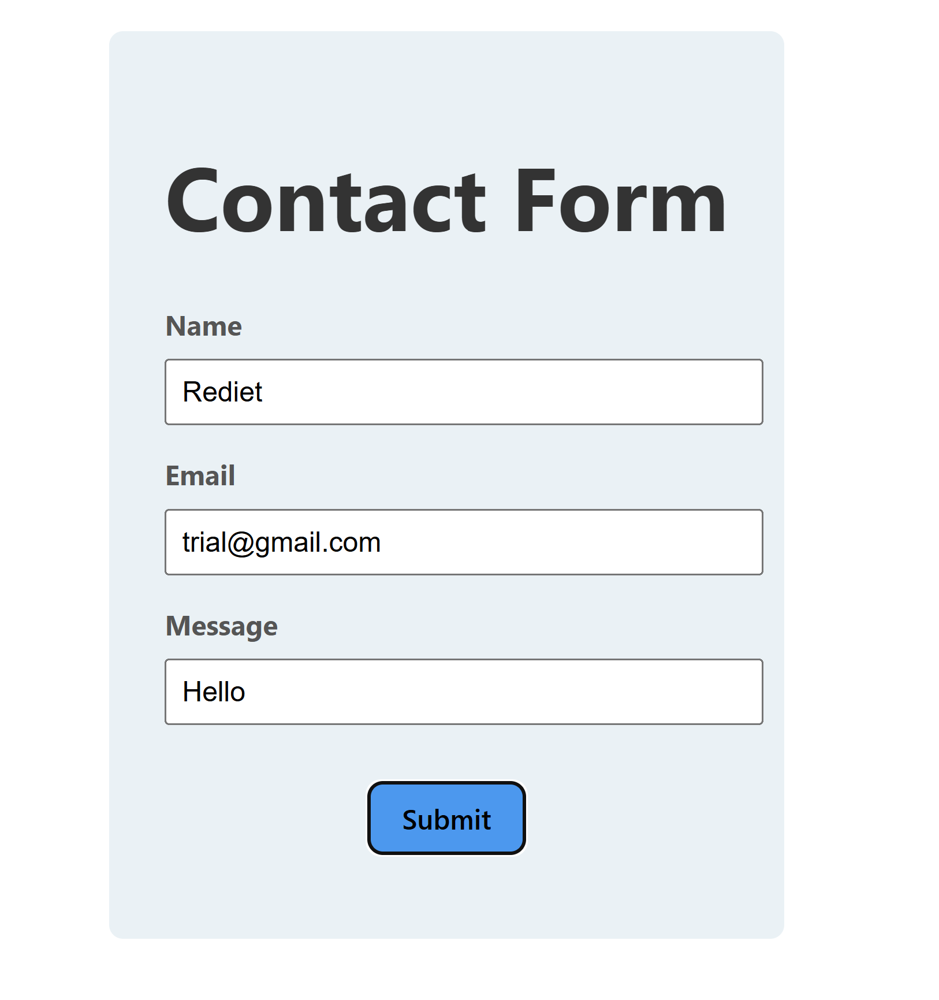

# Simple Contact Form using React and `useForm` Hook

## Description
This project implements a simple contact form using React and the `useForm` hook from the `react-hook-form` library. The contact form includes fields for Name, Email, and Message, with validation to ensure required fields are filled and the email format is correct. The form state and validation are managed using the `useForm` hook, making it easy to handle form submissions and display error messages for invalid inputs.

## Features
- **Form Fields**: The form includes fields for Name, Email, and Message.
  - Name: Required.
  - Email: Required and must be in a valid email format.
  - Message: Required.
- **Form Validation**: Proper validation for required fields and email format.
- **Error Messages**: Displays error messages for invalid form inputs.

## Instructions to Run the Project

### Clone the Repository
```bash
git clone https://github.com/yourusername/simple-contact-form.git
cd simple-contact-form
npm install
npm start
```

Open your browser and navigate to http://localhost:3000 to view and interact with the contact form.

### Images

### default state with all fields empty and no validation messages displayed.


### displaying error messages indicating that the Name, Email, and Message fields are required.


### An error message for the Email field, indicating that the entered email format is invalid.


### With all fields filled out correctly and no error messages displayed


